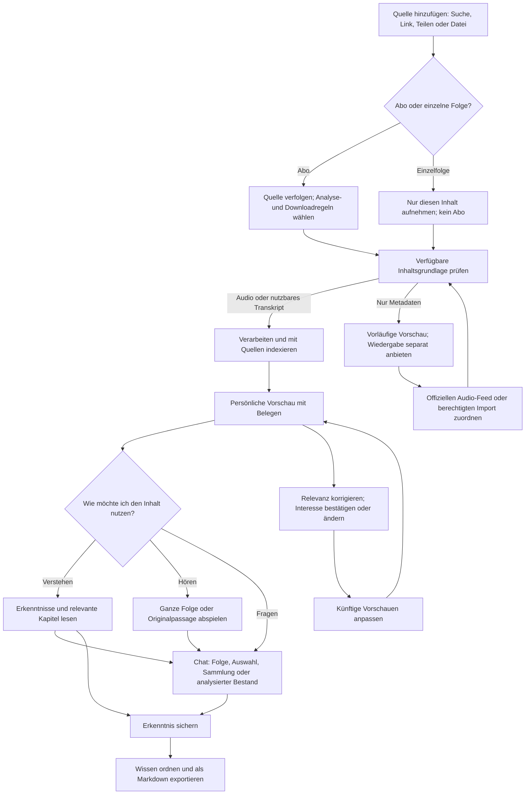
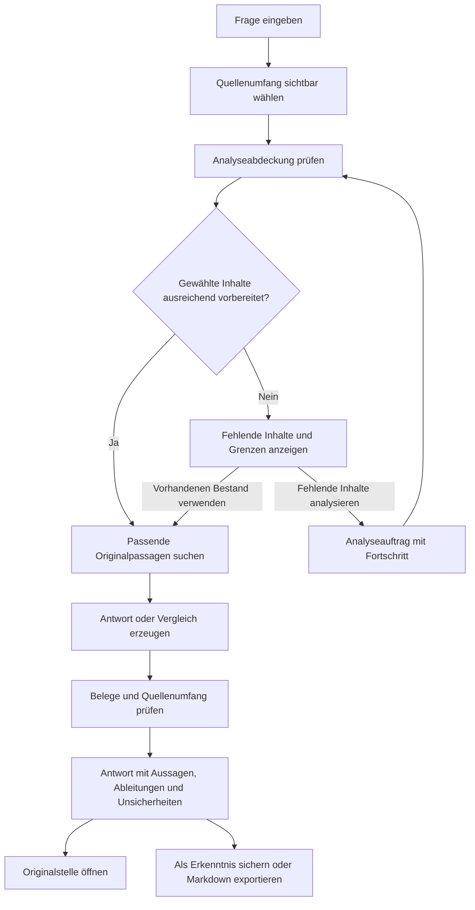
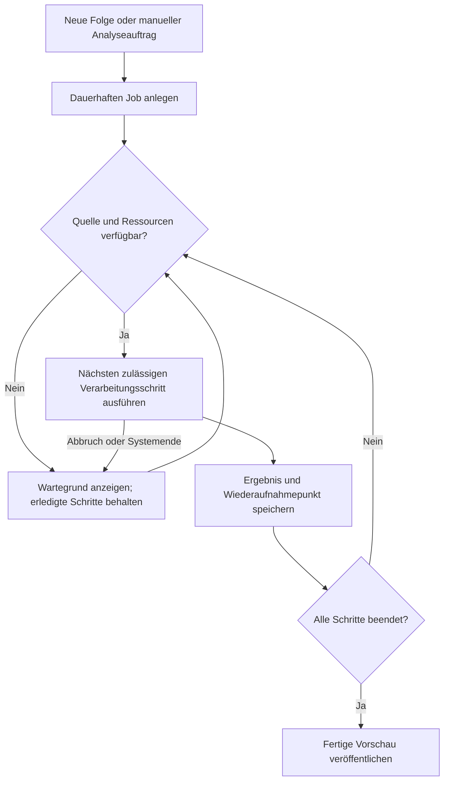

# BrainSpeak Podcasts — User Flow Design

**Stand:** 19. September 2026  
**Status:** Interaktionsentwurf; keine implementierte Oberfläche. Die Mermaid-Diagramme sind editierbare Flow-Spezifikationen.  
**Grundlage:** `01_Produktkonzept.md`, einschließlich Quellen und Machbarkeitsgrenzen.

## 1. Leitentscheidungen

Der Hauptweg führt von einer Quelle über eine persönliche Vorschau zum Verständnis. Wiedergabe ist ein gleichwertiger Abzweig und keine Pflichtstation. Die Anwendung hält den Quellenumfang einer Frage sichtbar, unterscheidet analysierte Inhalte von Metadaten und trennt Hörfortschritt von Wissensbearbeitung.

Die primäre Aktion einer vollständig vorbereiteten Folge lautet **Verstehen**. Der Player bleibt von jeder Folgenansicht aus direkt erreichbar. Eine nicht vorbereitete Folge zeigt **Inhalt auswerten**, während **Hören/Ansehen** unabhängig verfügbar bleibt.

## 2. Gesamtfluss

Die Rückkopplung verändert Empfehlungen, nicht die historischen Quellen. Der Originalinhalt wird nie durch eine personalisierte Zusammenfassung ersetzt.

## 3. Screen-Verzeichnis

| ID | Screen | Inhalt | Hauptaktion | Rückweg |
|---|---|---|---|---|
| S00 | Einstieg | Nutzenversprechen, erste Quelle, optional ein Interessensatz | Quelle hinzufügen | Einstieg überspringen |
| S01 | Für dich | Vorbereitete Erkenntnisse, Relevanzbegründung, Analysezustände | Verstehen | Hauptnavigation |
| S02 | Hinzufügen | Suche, RSS-/YouTube-Link, Dateiauswahl, OPML | Quelle prüfen | Abbrechen |
| S03 | Quellen-Vorschau | Sendung/Kanal, Folgen, verfügbare Funktionen | Abonnieren oder Einzelfolge | S02 |
| S04 | Abo-Einstellungen | Analysepolitik, Download, Archivumfang | Übernehmen | S03 |
| S05 | Folge verstehen | Persönlicher Nutzen, Kurzfassung, Aussagen, Belege | Fragen oder Stelle hören | Herkunftsliste |
| S06 | Player | Wiedergabe, Kapitel, Transkript, Merken | Hören / Pause | Mini-Player |
| S07 | Fragen | Sichtbarer Quellenumfang, Abdeckung, Chat | Frage senden | Letzter Inhalt |
| S08 | Beleg | Originaltext, Folge, Datum, Zeitbereich, Medienfassung | Im Original hören | Antwort/Erkenntnis |
| S09 | Wissen | Gesicherte Erkenntnisse, Notizen, Themen | Erkenntnis öffnen | Hauptnavigation |
| S10 | Export | Umfang, Vorschau, Quellen, Ziel | Markdown teilen/sichern | Ausgangsobjekt |
| S11 | Interessen | Bestätigte Themen, Vorschläge, Projektbezug | Korrigieren | Profilmenü |
| S12 | Verarbeitungsstatus | Jobs, Wartegründe, Teilfortschritte | Fortsetzen/Pausieren | Ausgangsobjekt |

## 4. Flow A — Erster Start bis zur ersten Erkenntnis

**Nutzerziel:** Den Nutzen erleben, ohne zuerst eine ganze Bibliothek oder ein ausführliches Profil aufzubauen.

`S00 Einstieg → S02 Quelle hinzufügen → S03 Vorschau → einzelne Folge oder Abo → erste Analyse → S05 Verstehen`

Beim Einstieg kann der Nutzer mit einem Satz ein Interesse angeben, etwa „Ich suche praktische Erfahrungen mit lokaler KI“. Dieser Schritt ist überspringbar. Auch ein Account ist für die lokale Mediathek nicht als Voraussetzung vorgesehen; PCC folgt den tatsächlichen Apple-Voraussetzungen aus dem Produktkonzept.

Nach Einfügen einer Quelle zeigt die App ihren Typ und die verfügbaren Funktionen. Statt ungefragt das gesamte Archiv zu analysieren, wird eine konkrete Folge ausgewählt. Bei einem Abo wird zusätzlich festgelegt, wie neue Folgen behandelt werden.

Die erste fertige Analyse führt direkt zur Folgenansicht. Dort stehen zwei oder drei belegte Erkenntnisse und eine passende Beispiel-Frage. Der Nutzer muss nicht selbst eine gute erste Frage formulieren, kann aber jederzeit eine eigene stellen.

**Erfolg:** Eine Erkenntnis wurde geöffnet, gespeichert oder im Original geprüft. Eine komplett abgespielte Folge ist kein notwendiges Erfolgskriterium.

**Fehler-/Abbruchpfad:** Quelle nicht erreichbar → Link korrigieren oder Import abbrechen. Sprache/Modell nicht verfügbar → Grund erklären und nutzbare Player-Funktionen beibehalten. Bei fehlender Inhaltsgrundlage nur die Metadaten-Vorschau zeigen.

**Berechtigungen:** Benachrichtigungen erst anfragen, wenn der Nutzer Hinweise zu neuen Erkenntnissen aktiviert. Dateizugriff erst bei Import/Export. Ein Audioimport braucht im Design keine Mikrofonfreigabe.

## 5. Flow B — Abonnieren, aber nicht zwingend hören

**Nutzerziel:** Neue Folgen sollen Wissen liefern, ohne eine immer längere Hörwarteschlange zu erzeugen.

`S03 Quelle → Abonnieren → S04 Abo-Einstellungen → S01 Für dich`

Die Auswahl enthält drei unabhängige Einstellungen:

- **Neue Folgen verfolgen:** Das eigentliche Abonnement.
- **Inhalte automatisch auswerten:** Neue Folgen für den Wissensbestand erschließen.
- **Audio offline behalten:** Medien dauerhaft für Wiedergabe verfügbar halten.

Ein temporärer Analysedownload wird separat erklärt. „Nicht offline behalten“ darf nicht den Eindruck erzeugen, dass niemals Daten übertragen werden.

Die App zeigt anschließend den gewählten Modus, beispielsweise: „Neue Folgen werden ausgewertet. Deine Hörwarteschlange bleibt unverändert.“ Die Analysewarteschlange und die Hörwarteschlange sind getrennt einsehbar.

**Archiv:** Alte Folgen nur auf ausdrückliche Auswahl nachladen. Eine Auswahl benennt Anzahl und, soweit bekannt, Datenvolumen. Keine präzise Fertigstellungszeit behaupten, solange keine belastbare Schätzung existiert.

## 6. Flow C — Einzelne Folge ohne Abonnement

**Nutzerziel:** Einen Link aus einer anderen App sofort verwenden.

`Teilen-Menü oder Link → S03 Einzelfolgen-Vorschau → Hören/Ansehen oder Nur diese Folge auswerten → S05/S06`

Das Teilen einer Folge erzeugt kein automatisches Abo. Die Anzeige „Kein Abonnement“ bleibt sichtbar. Erst die zusätzliche Aktion „Sendung abonnieren“ verfolgt künftige Folgen.

Bei identischem Inhalt in der Mediathek öffnet die App die vorhandene Folge, statt einen zweiten Wissenseintrag anzulegen. Unsichere Dubletten werden als mögliche Übereinstimmung behandelt. Eine anders geschnittene RSS-/YouTube-Fassung darf nicht anhand eines ähnlichen Titels blind zusammengelegt werden.

## 7. Flow D — Schon bei der Auswahl erkennen, was relevant ist

**Nutzerziel:** Vor dem Hören entscheiden, ob die Folge Zeit verdient.

`S01 Für dich → Relevanzkarte → S05 Verstehen → Erkenntnis lesen oder gezielte Passage hören`

Die Karte nennt ihr Fundament: „Titel und Beschreibung“, „Teilweise analysiert“ oder „Vollständig ausgewertet“. Nur vorbereitete Inhalte enthalten als solche dargestellte Erkenntnisse und belegte Zeitmarken.

In S05 kann der Nutzer von der persönlichen Kurzfassung zur neutralen Folgenübersicht wechseln. Damit bleibt die Personalisierung eine Sicht auf das Material, nicht die einzige erlaubte Sicht.

Die Aktionen „Schon bekannt“ und „Nicht relevant“ bedeuten Unterschiedliches. Bekanntes kann wichtig sein, ohne neu zu sein. Irrelevantes verändert nur den zugehörigen Themen-/Projektbezug und darf nicht ungefragt den ganzen Podcast ausblenden.

**Optionaler Hörweg:** „Relevante Stellen hören“ startet eine explizite Auswahl von Originalpassagen. Sprünge werden angekündigt; der Nutzer kann jederzeit zur vollständigen Folge wechseln. Eine künstlich vorgelesene Zusammenfassung wäre ein eigener, als generiert markierter Modus.

## 8. Flow E — Vom Hören zur Frage

**Nutzerziel:** Eine unklare Aussage verstehen, ohne die Fundstelle zu verlieren.

`S06 Player → Zu dieser Stelle fragen → S07 Chat im Umfang Diese Folge → S08 Beleg → zurück zur Wiedergabe`

Die App übernimmt die aktuelle Folge und den betreffenden Zeitbereich. Die Frage kann lauten: „Was meint er hier mit Betriebsaufwand?“ Der konkrete Sprechername wird nur gezeigt, wenn er belastbar zugeordnet ist.

Die Antwort verweist auf gespeicherten Originaltext. „Im Original hören“ springt zum Beleg und erhält einen Rückweg zur vorherigen Wiedergabeposition. Ein Quellenwechsel darf nicht ungefragt die bisherige Hörwarteschlange überschreiben.

**Noch kein Transkript:** Der Chat zeigt „Diese Stelle ist noch nicht analysiert“ und bietet die verfügbare Analyse an. Er improvisiert nicht aus dem Episodentitel.

## 9. Flow F — Eine Frage an mehrere oder alle Folgen

**Nutzerziel:** Erkenntnisse verbinden, nicht nur Zusammenfassungen nebeneinanderstellen.

Im Auswahlkopf stehen „Diese Folge“, „Auswahl“, „Sammlung“ und „Alle analysierten Folgen“. Ein breiterer Umfang muss aktiv gewählt werden. Die App beantwortet eine Frage nicht heimlich mit fremden oder externen Quellen.

Ein Vergleich kann die Struktur „Gemeinsamkeiten — Unterschiede — Gegenpositionen — Was folgt daraus? — Offene Punkte“ verwenden. Veröffentlichungsdaten bleiben sichtbar, damit veränderte Aussagen nicht allein als logische Widersprüche erscheinen.

Bei einer Frage wie „Nenne alle genannten Risiken“ reicht eine übliche Top-Treffer-Suche nicht. Die Anwendung muss den ausgewählten Bestand systematisch abarbeiten oder ausdrücklich ein nicht vollständiges Ergebnis anbieten. Nicht analysierte Folgen werden nicht als durchsucht gezählt.

**Keine Evidenz:** „In den analysierten Quellen finde ich dazu keine belastbare Stelle.“ Das ist ein zulässiger Ergebniszustand, kein Anlass, eine passende Aussage zu erfinden.

## 10. Flow G — Das System lernt, was relevant ist

`Relevanzkarte → Warum empfohlen? → angezeigter Themen-/Projektbezug → Bestätigen oder Korrigieren → aktualisierte Vorschau`

Ein neues vermutetes Interesse erscheint als Vorschlag: „Soll ich neue Inhalte zu Modellbetrieb stärker berücksichtigen?“ Der Nutzer kann zustimmen, ablehnen oder den Bezug nur einem aktuellen Vorhaben zuordnen.

Bestätigte Themen und nur vermutete Themen bleiben unterscheidbar. Ein gelöschtes Profil wird nicht unmittelbar aus alten Verhaltensevents unbemerkt neu erzeugt; die zugehörigen Personalisierungsdaten werden entsprechend der Löschentscheidung behandelt.

Die App bietet die Sicht „Neueste Folgen“ ohne personalisierte Sortierung an. Gegenpositionen zu bestätigten Themen dürfen bewusst sichtbar bleiben.

## 11. Flow H — Wissen sichern und Markdown exportieren

`S05/S07 Erkenntnis → S09 Wissen → S10 Export → Vorschau → Teilen-Menü oder gewählter Speicherort`

Der Nutzer wählt eine Folge, eine Erkenntnis, einen Vergleich oder eine Sammlung. Die Vorschau zeigt Inhalt, Quellen und Zeit-/Absatzbelege. Eigene Notizen stehen in einem eigenen Abschnitt und werden nicht mit KI-Ableitungen verschmolzen.

Vor dem Export prüft die App, dass private Feed-URLs keine Zugangstoken preisgeben. Ein Volltranskript wird nicht standardmäßig angehängt. Der Export nennt seine Analysegrundlage und enthält auch bei einem appinternen Zeitlink eine lesbare Zeitangabe.

**Erfolg:** Die exportierte Datei ist außerhalb der App verständlich und ihre Quellen sind nachvollziehbar.

**Abbruch:** Das Schließen des Teilen-Menüs ist kein erfolgreicher Export. Die gespeicherte Erkenntnis bleibt trotzdem erhalten.

## 12. Zustände: Medien, Analyse und Wissen getrennt

| Ebene | Beispiele | Keine automatische Gleichsetzung |
|---|---|---|
| Wiedergabe | Nicht begonnen, in Bearbeitung, beendet | „Beendet“ bedeutet nicht „verstanden“. |
| Mediendatei | Nur Stream, wird geladen, offline, gelöscht | „Audio gelöscht“ bedeutet nicht „Wissen löschen“. |
| Analyse | Nur Metadaten, geplant, läuft, teilweise, fertig, fehlgeschlagen | „Fertig“ bedeutet nicht „inhaltlich fehlerfrei“. |
| Wissensbearbeitung | Neu, gelesen, gespeichert, als bekannt markiert | „Gelesen“ bedeutet nicht „gehört“. |
| Modellverfügbarkeit | Lokal verfügbar, PCC verfügbar, Kontingent ausgeschöpft | PCC-Ausfall darf vorhandene Inhalte nicht sperren. |

### Wiederaufnahme im Hintergrund

Diese Darstellung ist eine Soll-Logik, kein Versprechen eines festen iOS-Ausführungsplans. Nutzerinitiierte fortgesetzte Aufgaben, geplante Hintergrundarbeit, Downloads und Audio-Wiedergabe werden technisch getrennt behandelt. Details und Apple-Quellen stehen im Produktkonzept.

## 13. Mikrotexte für kritische Fälle

| Situation | Vorgesehener Text |
|---|---|
| Nur Metadaten verfügbar | „Vorschau aus Titel und Beschreibung. Der Inhalt wurde noch nicht analysiert.“ |
| Teilanalyse | „Die ersten 24 von 68 Minuten sind ausgewertet. Diese Übersicht ist noch unvollständig.“ |
| YouTube ohne Inhaltszugang | „Video verfügbar. Für die Wissensanalyse fehlt ein nutzbares Transkript oder eine berechtigt verfügbare Audiodatei.“ |
| Quellenlücke im Chat | „6 Folgen dieser Auswahl sind noch nicht analysiert. Mit dem vorhandenen Bestand fortfahren?“ |
| PCC-Kontingent erreicht | „Die erweiterte Analyse ist derzeit nicht verfügbar. Deine lokale Suche und gespeicherten Erkenntnisse bleiben nutzbar.“ |
| Beleg passt nicht zur Dateifassung | „Die Audiodatei wurde geändert. Diese Zeitmarke muss neu abgeglichen werden.“ |
| Empfehlung korrigiert | „Diese Rückmeldung gilt für dein Vorhaben. Das Podcast-Abonnement bleibt bestehen.“ |
| Keine Belegstelle | „In den analysierten Quellen finde ich dafür keinen ausreichenden Beleg.“ |

Zahlen in diesen Textbeispielen sind illustrative UI-Daten und keine Messwerte.

## 14. Wichtigster Durchstichtest

Ein Nutzer fügt ein RSS-Abo hinzu, lässt eine Folge erschließen, hört sie nicht, öffnet ihre persönliche Vorschau, stellt eine Frage, prüft eine Fundstelle im Original und exportiert die Erkenntnis in Markdown.

Wenn dieser Weg überzeugend funktioniert, zeigt die Anwendung ihren AI-First-Nutzen. Ein großer Funktionsumfang im Player ersetzt diesen Nachweis nicht.
