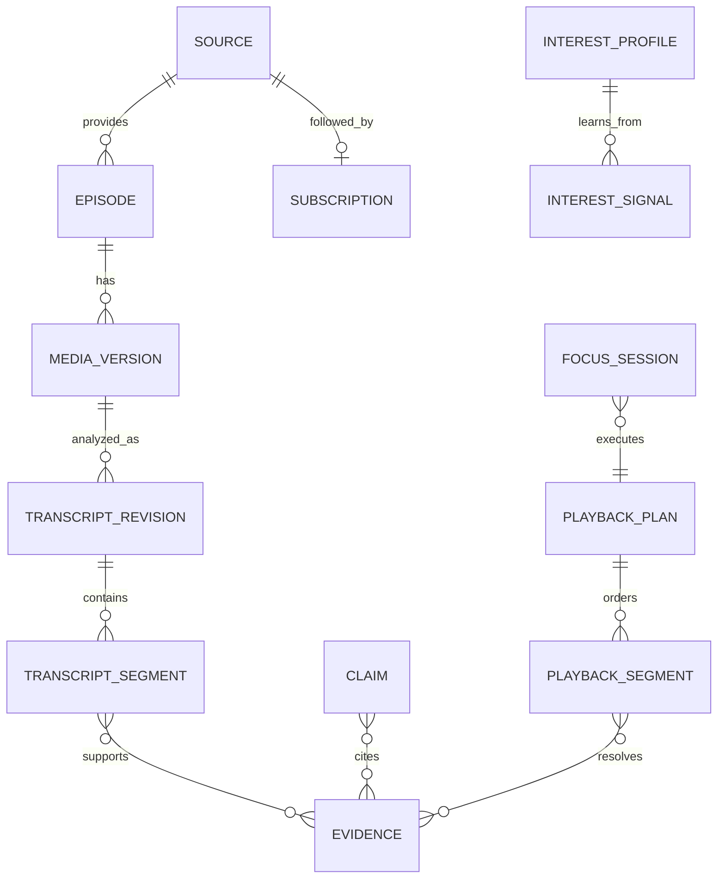

# Data Model — versioniert, quellengebunden, synchronisierbar

**Status:** normativer Zielentwurf. Abbildung auf vorhandene BrainSpeak-Models erst nach Audit. Alle Produktions-IDs sind UUIDs oder gleichwertige unveränderliche opake IDs; lesbare Fixture-IDs dienen nur Tests. Modelltypen sind nicht identisch mit SwiftData-Klassen: Domain-Snapshots sind immutable Codable/Sendable-Werte.

## Aggregate und Felder

| Entity | Wesentliche Felder | Owner / Lebensdauer |
|---|---|---|
| Source | id, kind, canonicalPublicURL?, privateLocatorRef?, title, language, capabilities, rightsBasis, updatedAt | Mediathek; syncfähige sichere Metadaten |
| SourceCapabilities | canSubscribe, canNativeAudio, canVisibleVideo, canDownload, canAnalyzeText, canAnalyzeAudio, canTimedPlayback, reasonCodes | durch Adapter und Rechteprüfung; versioniert |
| Subscription | id, sourceID, enabled, autoAnalyze, autoQueue, retainAudio, archivePolicy, networkPolicy | Nutzerbeschluss |
| Episode | id, sourceID, publisherGUID?, title, publishedAt, durationMs?, publicPage?, mediaVersionIDs, latestMetadataRevision | Identität nicht allein Download-URL |
| MediaVersion | id, episodeID, contentHash?, hashAlgorithm?, byteLength?, durationMs?, etag?, retrievedAt, identityStatus, rightsSnapshot, localFileRef? | immutable nach finalization |
| TranscriptRevision | id, mediaVersionID?, origin, locale, contentHash, timingStatus, completeness, analyzerVersion, sourceReference | immutable; neue Analyse = neue Revision |
| TranscriptSegment | id, transcriptRevisionID, ordinal, text, startMs?, endMs?, final, speakerLabel?, speakerVerification | nur finale Segmente indexieren |
| Chapter | id, mediaVersionID, startMs, endMs?, title, origin, artworkRef?, alignmentStatus | Publisher/embedded/AI getrennt |
| Evidence | id, episodeID, mediaVersionID?, transcriptRevisionID, segmentIDs, excerpt, startMs?, endMs?, timingStatus, textHash, accessRevision | bindet Aussage an Original |
| Claim | id, kind, text, evidenceIDs, modelRunID, generatedAt, version, verificationStatus | sourceStatement / inference; keine unbewiesene truth-Flag |
| InsightNote | id, text, owner, evidenceIDs, tags, userAuthored, revision, conflictOf? | menschlich editierbar; ConflictCopy |
| InterestProfile | id, epoch, explicitTopics, tentativeTopics, activeProjects, openQuestions, learningEnabled, revision | nach Einwilligung; explizit/vorgeschlagen getrennt |
| InterestSignal | id, profileID, epoch, kind, targetID, topicID?, occurredAt, originDeviceID, consentVersion | append-only; keine sensiblen Attribute |
| ChatScope | id, selectedEpisodeIDs, collectionSnapshot?, availableRevisionIDs, createdAt, coverageLedgerID, scopeDigest | immutable pro Request |
| ChatTurn | id, conversationID, request, scopeID, response, evidenceIDs, status, modelRunID | Scope nicht nur als Prompttext |
| ModelRun | id, platform, osBuild?, modelKind, modelVersion?, promptVersion, contextBudget, responseStatus, usedEvidenceIDs | private minimale Diagnostik; keine geheime chain-of-thought |
| PlaylistProposal | id, requestedEvidenceIDs, orderingReasons, budgetMs, preferredRate, intentOrigin | untrusted; noch nicht ausführbar |
| PlaybackPlan | id, revision, scopeDigest, segments, activeListeningBudgetMs, playbackRate, transitionMs, estimatedListeningMs, planHash, validatedAt | immutable, deterministisch geprüft |
| PlaybackSegment | id, episodeID, mediaVersionID, transcriptRevisionID, evidenceIDs, coreRange, playbackRange, reason, rankOrigin | konkrete, endliche Originalintervalle |
| PlaybackGrant | id, deviceID, sessionID, planHash, sourceConsentRevision, issuedAt, expiresAt, kind, consumedAt? | rein lokal, nicht synchronisieren/exportieren |
| FocusSession | id, planID, currentSegmentIndex, sessionToken, state, previousPlaybackSnapshot, activeListeningMs, pendingRate? | ein Besitzer pro Gerät |
| ListenEvent | id, mediaVersionID, sessionID, seq, eventKind, range?, positionMs?, userInitiated, occurredAt, deviceID | union of listened ranges; Seek kein Hören |
| ProcessingJob | id, jobKey, mediaVersionID, step, checkpoint, progress, state, waitReason, retries, ownerDeviceID, policyRevision | lokale Scheduling-Wahrheit |
| WatchPack | id, revision, evidenceIDs, planID?, fileManifest, requiredBytes, transferredBytes, checksumStatus, state | vollständig bevor offline-ready |
| SyncEnvelope | recordID, entityKind, revision, baseRevision?, originDeviceID, logicalCounter, tombstone, profileEpoch? | explizite Merge-Regeln |
| ExportArtifact | id, kind, sourceIDs, safeLinks, generatedAt, exportPolicyVersion, checksum, localFileRef | nicht automatisch als CloudKit-Datei verteilen |

## Zeit und Identität

Intervallkonvention ist immer `[startMs, endMs)` in der Zeitachse **der Originalmedienfassung**, mit 64-Bit-Integern. Für JSON werden Werte auf sichere Integergrenzen beschränkt. `0 <= startMs < endMs <= durationMs` gilt, sobald eine endliche Dauer vorliegt. `CMTime` wird im Media-Adapter mit konsistentem Timescale konvertiert. Audiosamples besitzen eine andere Darstellung; Rundung wird nur an definierten Grenzen vorgenommen.

Originalzeit, aktive Wiedergabezeit bei z. B. 1,25× und verstrichene Uhrzeit sind unterschiedliche Größen. Ein 10-Minuten-Fokus meint standardmäßig maximal zehn Minuten **aktive Hörzeit**, einschließlich automatisch eingeplanter Übergänge, nicht einschließlich nutzerseitigem Pausieren oder Netzwartezeit. Die UI sagt dies ausdrücklich. Kein Versprechen einer Uhrzeit-Deadline.

Gleiche URL bedeutet nicht gleiche MediaVersion. Ein endgültiger Bytehash ist stärker als ETag oder Dateigröße. Solange nur schwache Metadaten vorliegen, bleibt Identität provisional. Re-Downloads mit anderer Fassung invalidieren zeitbezogene Belege. Der Nutzer kann die lokal erhaltene alte Fassung weiter verwenden, solange zugänglich und zulässig.

Ein Podcast und dessen YouTube-Version können `relatedEpisodeIDs` besitzen, ohne dass ihre Zeiten identisch sind. Automatischer Sekundentransfer zwischen Fassungen ist verboten. Eine spätere Alignment-Funktion benötigt eigene, verifizierte Mapping-Records.

## Invarianten

1. Ein finaler TranscriptSegment gehört genau einer TranscriptRevision; diese ist an die bewertete Medienfassung oder ausdrücklich nur an eine Textquelle gebunden.
2. Zeitbasierte Evidence besitzt MediaVersion, finale Segment-IDs und bestätigten Timingstatus. Text-Evidence darf ohne Zeitangabe existieren, ist dann nicht automatisch abspielbar.
3. Jeder persistierte Claim hat mindestens einen erlaubten Beleg; reine Nutzer-Notizen sind als solche ausgenommen.
4. Ein PlaybackSegment enthält den Kernbeleg vollständig; playbackRange erweitert coreRange, kürzt ihn nicht unbemerkt.
5. Alle Evidence-IDs eines Segments gehören zur selben Medien- und Transkriptrevision. Zusammenführen über Quellen-/Fassungsgrenzen ist verboten.
6. Ein PlaybackPlan ist nach Erteilung des Grants unverändert. Änderungen erzeugen neue Revision/Hash und erfordern Revalidierung.
7. Ein PlaybackGrant ist keine generische Vollmacht. Er gilt nur auf dem ausstellenden Gerät, für eine Session, einen Plan und eine aktuelle Policyrevision.
8. Profilreset erhöht `epoch`. Signale mit älterer Epoch dürfen das Profil nicht verändern, auch wenn sie später eintreffen.
9. Hörfortschritt wird aus tatsächlich gespielten Intervallen berechnet, nicht aus höchster Seekposition. Fokusmodus setzt `played` nicht pauschal auf true.
10. Coverage ist die Vereinigung finalisierter Intervalle, nicht deren naive Summe. Metadata-only und text-only haben gesonderte Metrik.
11. Gelöschte Entitäten werden nicht allein aus älteren Sync-Records wiederhergestellt. Tombstones und Beziehungen werden gemeinsam geprüft.
12. Kein globaler Import von ModelContext/SwiftData-Objekten über Nebenläufigkeitsgrenzen. Snapshots und IDs sind die Transferform.

## Beziehungen

## SwiftData und CloudKit-Grenze

Lokaler SwiftData-Store führt die fachliche Wahrheit. Er verwendet eigene Indizes und Migrationspläne. Der CloudKit-Sync ist ein expliziter Adapter mit einer definierten subsetfähigen Record-Mapping-Tabelle; nicht die automatische SwiftData-CloudKit-Anbindung für dieselben Models einschalten. [A12–A14]

Lokal-only: Grants, Playerinstanz, Dateipfade, Keychainreferenzen, flüchtige Jobs, PCM-Zwischendaten, Core-Spotlight-Index und sensible Diagnostik. Sync-fähig nach Zustimmung: sichere Quellenmetadaten, Episode-ID, bestätigte Erkenntnisse, finale Transkripte gemäß Inhalts-/Datenschutzpolicy, Profil, Fokuspläne und Notizen. Große Texte in begrenzte Records/CKAssets partitionieren; Medien standardmäßig nicht in iCloud kopieren.

Privater CloudKit-Bereich ist nicht automatisch eine von der App nachgewiesene Ende-zu-Ende-Verschlüsselung. Das Produkt behauptet solche Eigenschaften nur nach tatsächlicher Implementierung/Prüfung. Lokale Datenklassen und Dateischutz müssen Hintergrundwiedergabe nach erstem Entsperren ermöglichen, ohne Geheimnisse unnötig verfügbar zu halten.

## Migration und Löschung

Schemaversion und deterministische Migrationsfixtures ab Version 1. Jede Migration erhält Fixtures für leeren, großen und teilweise beschädigten Store. Bei indexbezogenen Änderungen wird der Index erneuert, nicht die Quelle des Wissens gelöscht. Bei globaler Löschung Outbox/Tombstone zuerst sichern, dann lokale Daten/Medien/Index entfernen. Offline-Geräte können Daten bis zum nächsten Kontakt besitzen; die UI behauptet keine sofortige weltweite Löschung.

## Ergänzende Aggregate
`SourceResolution`: inputKind, resolvedVideoID?, verifiedChannelID?, handle?, canonicalFeedURL?, selectedTimestampMs?, resolutionEvidence, capabilitySnapshot, status. LLMs lösen keine Kanalidentität aus Namen auf.

`ArchiveSnapshot`: id, sourceID, enumeratorKind, observedAt, cursor?, catalogState, selectedFilter, selectedEpisodeIDs, discoveredCount, analyzableCount, analyzedCount, unavailableCount, analysisState. `BackfillJob`: snapshotID, approvedPolicy, childJobIDs, prioritization, checkpoint, retryCount, pausedReason. Katalogvollständigkeit und Analysevollständigkeit sind getrennt.

`Highlight`: id, evidenceIDs, originalExcerpt, userNote, generatedSummary?, provenance, tags, timingStatus, revision, conflictOf?. `TranscriptWord`: tokenText, startMs?, endMs?, alignmentSource; nur bei vorhandenen Zeitdaten. `SkipCandidate`: mediaVersionID, range, category, provenance, reviewStatus, policyRevision; Originalaudio bleibt unberührt.

`AgentShareGrant`: id, localClientBinding, allowedSourceIDs, allowedTools, disclosureVersion, revokedAt?, revision. Rein lokal; nicht mit PlaybackGrant verwechseln. `SearchIndexRevision`: corpusRevision, embeddingOrSystemIndexVersion?, privacyPolicyVersion, state, indexedEvidenceIDs. Indexdaten sind abgeleitet.

## Gegenpositionen und Wissenspfade (1.2)
| Aggregat | Felder und Invarianten |
|---|---|
| Stance | id, revision, text, topic, status, origin, supportingNoteIDs, sensitivity, profileEpoch; confirmed setzt explicitUser voraus |
| CounterpointSet | targetStanceID/revision, scope, sourceCount, relations, reviewStatus; jeder Vergleich referenziert Evidence-IDs |
| KnowledgeSession | id, parentSessionID, questionNodeID, scopeDigest, usedEvidenceIDs, state, closeRevision, checkpoint, budget; parent-Kette azyklisch |
| ClosingDecision | id, sessionID, closingRevision, choice, eventSequence, originDeviceID, exportID, undoUntil; unbeantwortet ist gültig |
| KnowledgeNode | id, kind, text, origin, curationState, evidenceIDs, sourceStatus, revision; Nutzernotiz und Quellenclaim getrennt |
| KnowledgeEdge | id, fromID, toID, relation, origin, reviewStatus, evidenceIDs; zwei vorhandene Endpunkte, semantische Richtung |
| TrailExport | id, trailID, revision, scope, nodeIDs, edgeIDs, status, manifestHash, safeDestinationReference; kein roher Ordnerpfad aus Modelltext |

Parken ändert curationState, nicht epistemischen Status. Verwerfen erzeugt ein reversible Trail-Entscheidung und löscht keine referenzierten Highlight-/Medienaggregate. Inhaltliche Graphzyklen sind zulässig, Abstammungszyklen von Sessions nicht. Plattformübergreifende IDs bleiben unabhängig von SwiftData ObjectIDs.

## Additive Datenmodelle 1.3
| Entität | Kernfelder und Regeln |
|---|---|
| SmartPodcastFeed | ID, Titel, topicIDs, Source-Scope, profileRevision, Policyrevision, publicationPolicy, unheardFilter, editionMode, Budget, Generationstatus; privat und ohne Pflichtserver. |
| PersonalEpisode | ID, feedID, revision, batchKey, Titel, Shownotes mit Evidence-IDs, Datum, Cover-ID, Manifest, totalMediaMs, publicationState, consumptionState. Audioidentität ist unabhängig vom Cover. |
| PersonalEpisodeSegment | Originalepisode, MediaVersion, TranscriptRevision, Evidence-IDs, coreRange, playbackRange, virtualRange, topicIDs, contextReplay; virtuelle Dauer ist exakt die Originalwiedergabedauer. |
| ListeningLedger | Epoch und deduplizierbare Wiedergabeevents; Originalzeit-Intervallunion je Medienfassung. ManualDisposition ist separat, keine erfundene Wiedergabe. |
| SegmentReservation | MediaVersion, coreRange/Evidence, persönliche Episode, Zustand pending/published/released, Policyrevision; vermeidet doppelte neue Ausgaben über Feeds. |
| CoverAsset | ID, revision, origin nativeTemplate/userConfirmedImagePlayground/userSelectedImage/reusedFeedArtwork, SHA-256, lokaler Assetverweis, Format/Größe, Alt-Text, bestätigte Auswahl, Apple-only-Anbieterpolicy. |

Veröffentlichte Episodenmanifeste sind unveränderliche Snapshots. Eine aktualisierte Restversion erhält neue Revision und erneuten Grant; die ursprüngliche Ausgabe bleibt referenzierbar. Shownotes sind keine neuen Primärbelege. Zeiträume und Originaldaten werden nicht zwischen Medienfassungen kopiert.

JSON-Verträge: `smart-feed.schema.json`, `personal-episode.schema.json`, `listening-ledger.schema.json`, `cover-asset.schema.json`. Foundation-only Werttypen: `SmartFeedContracts.swift`. Semantische Validierung ergänzt Schemaprüfung, insbesondere Zeitmapping, Hash, Zustandsübergänge und Quellbindung.
