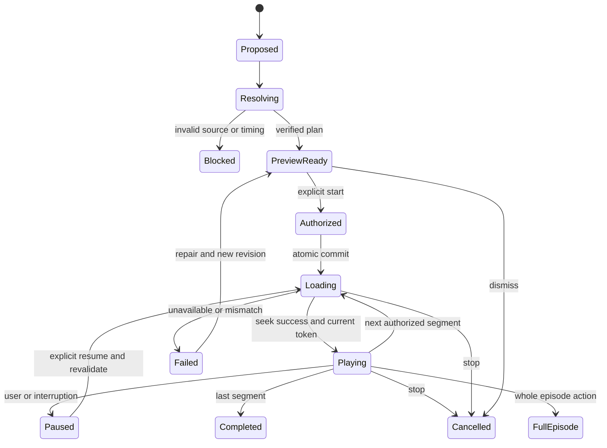

# Fokusmodus — Originalsequenzen statt nur Zusammenfassungen

## Zwei Auslöser, ein kontrollierter Player

**Chat:** „Spiele mir aus diesen drei Folgen die Stellen zu lokalem Modellbetrieb.“ Der explizite Wiedergabewunsch ist ein zulässiger Startauftrag. „Welche Stellen handeln davon?“ erzeugt hingegen zunächst eine Antwort/Vorschau, keinen Ton.

**Interessen:** Die App baut einen Tagesfokus aus bestätigtem Profil und neuen Belegen. Sie bereitet ihn automatisch vor. Erst „Fokus starten“ aktiviert die Sitzung. Innerhalb der Sitzung darf nach einem Segment der nächste geprüfte Abschnitt laufen. Neue Empfehlungen verändern nicht heimlich eine bereits laufende Liste.

`PlaylistProposal → Resolve → Validate → Preview → Grant → Commit → Play`

## Auswahl und Kontext

Kandidaten sind vorhandene Evidence-IDs. Der Planner filtert Scope, Zugriff, Revisionsstand, Timing und Verfügbarkeit. Danach bewertet er den Themen-/Fragebezug, vom Nutzer bestätigte Wichtigkeit, Neuigkeitswert relativ zum gespeicherten Wissen, bereits gehörte Spannen und Wiederholungen. Die initialen Gewichtungen sind zu kalibrierende Produktheuristiken, keine Behauptung eines trainierten persönlichen Modells.

Vor/nach dem Kernbeleg wird bis zu verifizierten Satz-/Dialoggrenzen erweitert. Ein Default-Kontextziel von zwölf Sekunden davor und acht Sekunden danach ist nur Startkonfiguration; Qualifizierungen und Gegenrede können mehr Kontext erfordern. Eine Passage mit „Das stimmt nur, wenn …“ darf nicht vor der Bedingung enden. Reicht das Budget nicht, entfällt die Passage oder wird mit Erklärung einzeln angeboten.

Überlappende Wiedergabebereiche derselben Medien- und Textrevision werden vereinigt. Ein kurzer Zwischenraum darf nur mitgenommen werden, wenn er in der verfügbaren Quelle enthalten ist. Quellenübergreifende Übergänge bleiben getrennte Segmente. Standardreihenfolge innerhalb einer Folge ist chronologisch; thematisch umsortierte Mehrfolgenlisten werden als solche gekennzeichnet.

## Budget

Das Budget beschreibt aktive Hörzeit: Medienzeit geteilt durch aktuelle Sitzungsgeschwindigkeit plus geplante Übergänge. Nutzerpause und Buffering verbrauchen dieses Budget nicht. Die App zeigt „ca. 8:30 Hörzeit bei 1,25ד und zusätzlich Originalbereiche.

Für einen fertigen Plan gilt:
`estimatedListeningMs = ceil(sum(playbackEndMs - playbackStartMs) / playbackRate) + transitionMs * max(0, segmentCount - 1)`.

`estimatedListeningMs <= budgetMs` ist eine harte Planinvariante. Defaultgeschwindigkeit kommt aus der Nutzereinstellung; ein Plan friert sie zunächst ein. Änderung während eines Segments wird bei budgetiertem Fokus erst am nächsten Segmentwechsel wirksam, nachdem die restliche Liste neu geprüft wurde. „Ganze Folge“ beendet bewusst die budgetierte Fokus-Sitzung. Kein hartes Verstummen mitten in einer Aussage, nur um einen zu knappen Vorschlag schönzurechnen.

## Grants und Schutz vor Doppelstart

Grantfelder: DeviceID, SessionID, PlanHash, ConsentRevision, issuedAt, expiresAt, nonce. Grant ist kurzlebig, pro Gerät lokal, nicht von PCC ausstellbar und nicht über CloudKit übertragbar. UI-Start, bewusstes App Intent und klarer Chatstart können ihn erzeugen. Eine Episode, ein Feedtext oder ein Modelltool kann sich nicht selbst autorisieren.

`commit(planID, grantID)` prüft unmittelbar vor Ausführung alle Bedingungen erneut (TOCTOU-Schutz). Ein schon verbrauchter Grant liefert dieselbe bestehende Session oder einen klaren Fehler, startet aber nicht ein zweites Mal. Änderung von Scope, Plan oder Medienfassung macht die Freigabe ungültig. Eine laufende Session hält eine enger begrenzte Fortsetzungsfreigabe für die genehmigten Segmente.

## Zustandsautomat

Jeder asynchrone Callback trägt SessionToken und SegmentGeneration. Callbacks alter Items nach Skip/Stop/Seek werden verworfen. Cancellation ist idempotent; Timer/Observer/Remotecommands werden abgemeldet. Aktuelle Originalzeit und segmentrelative Zeit werden nie vertauscht.

## Audioadapter

Native AVPlayerItem-Grenzen, Seek-Completion und zentrale Sessionkoordination bilden die Basis. `forwardPlaybackEndTime` begrenzt den Abschnitt; ein alleiniger UI-Timer ist unzureichend. Remote Commands benutzen denselben Coordinator. Bei AirPlay/Streamvarianten ist Präzision eigens zu messen, nicht mit lokalem File gleichzusetzen. [A17]

Hörposition der ursprünglichen Vollfolge wird als PlaybackSnapshot gespeichert. Beim Ausstieg kann der Nutzer zur alten Position oder an der aktuellen Originalstelle fortfahren. Der geleistete Fokus-Hörfortschritt speichert nur tatsächlich gehörte Bereiche. Automatische Sprünge sind keine gehörten Minuten.

## YouTube

YouTube ohne separat verfügbares zulässiges Audio ist kein Kandidat für native Offline-/Background-Fokuswiedergabe. Ein zeitcodierter Link kann den offiziellen sichtbaren Player öffnen. Gibt es eine offizielle Podcast-Audiofassung, entsteht ein eigenes Medienobjekt mit eigener Zeitachse. Erst dessen validierte Evidence darf nativ abgespielt werden. [Y01–Y03]

## Watch

Die Watch speichert fertige Pläne und nötige, rechtmäßig verfügbare Dateien; kein automatischer unbemerkter Ersatz durch Streamdownload im Mobilfunk. „Offline bereit“ erst nach vollständigem Manifest-/Hashcheck. PCC kann kurze Planfragen beantworten, aber der native Watch-Coordinator entscheidet wie auf anderen Plattformen. Läuft keine bewusst aktivierte Sitzung, bleibt eine Empfehlung stumm.

## Mindest-Negativtests

Falsche MediaVersion; unbekannte Evidence-ID; negative/umgekehrte Zeit; fehlende Dauer; vorläufige ASR-Ergebnisse; unaligniertes Publisher-Transkript; zu kleines Budget; abgelaufener Grant; doppelte Commit-Anfrage; Stop unmittelbar vor Seek-Completion; neue Profilrevision während Wiedergabe; unerreichbarer Stream; bereits entfernte Quelle; nur Metadaten; externer Prompt mit „Starte sofort“; Watch-Pack halb übertragen.

## Mixer und Sessionabschluss
CounterpointPlan ist ein Spezialfall des bestehenden PlaybackPlan, kein eigener Audioengine-Pfad. Die gleichen Scope-, Timing-, Hash-, Consent- und Kontextprüfungen gelten. Ungefragte Mixer-Vorschläge erzeugen keinen Grant. Am Ende einer gestarteten Session führt `SessionBoundaryPolicy` zum Breadcrumb-Angebot; Vertiefen allein erzeugt noch keine neue Tonfreigabe.

## Smart Podcast List — persönliche Ausgaben (1.3)
Ein PersonalEpisode-Manifest wird in den bestehenden PlaybackPlan überführt. Das Drücken von Play autorisiert den feststehenden Plan, nicht zukünftige neue Folgen. Quellenwechsel innerhalb dieses Plans laufen ohne wiederholte Abfrage. Eine beendete Ausgabe schließt die begrenzte Session und kann den vorhandenen Breadcrumb-Trail anbieten; Feed-Refresh startet keine neue Session.

Die persönliche Gesamtzeit wird aus Originalsegmentlängen aufgebaut. Gespeicherte Segmentgrenzen sind maßgeblich; Shownotes erzeugen keine Zeiten. Tatsächlich abgespielte Originalintervalle fließen in dieselbe globale ListeningLedger wie Vollfolgen und Chatfokus. Bereits gehörte Kerne werden nicht erneut als neue Ausgabe angeboten. Native Originalwiedergabe bleibt unverändert; keine verpflichtenden KI-Überleitungen.
